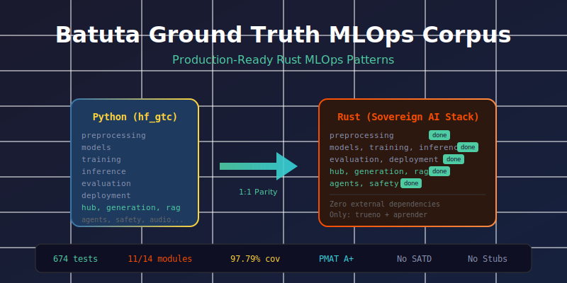

# Batuta Ground Truth MLOps Corpus



Production-ready Rust MLOps patterns for the **Sovereign AI Stack**. Full parity with [hf-ground-truth-corpus](https://github.com/paiml/hugging-face-ground-truth-corpus) using pure Rust with zero external dependencies.

## Quality Metrics

| Metric | Value |
|--------|-------|
| Tests | 998 |
| Coverage | 98.77% |
| Modules | 14/14 |
| PMAT Grade | A+ |
| External Deps | Zero |

## Modules

### P0 - Core MLOps (Complete)

| Module | Purpose | Key Types |
|--------|---------|-----------|
| `preprocessing` | Text tokenization, normalization | `Tokenizer`, `Normalizer`, `Augmenter` |
| `models` | Model configurations | `TransformerConfig`, `RandomForestConfig` |
| `training` | Training utilities | `Trainer`, `LearningRateScheduler`, `EarlyStopping` |
| `inference` | Inference pipelines | `InferencePipeline`, `BatchProcessor` |
| `evaluation` | Metrics and validation | `ClassificationMetrics`, `CrossValidator` |
| `deployment` | Export and quantization | `Exporter`, `Quantizer` |

### P1 - Hub, Generation, RAG (Complete)

| Module | Purpose | Key Types |
|--------|---------|-----------|
| `hub` | Model registry, versioning | `RegistryConfig`, `ModelStage`, `DatasetConfig` |
| `generation` | Text generation, sampling | `SamplingConfig`, `PromptTemplate`, `Conversation` |
| `rag` | Chunking, retrieval, reranking | `ChunkConfig`, `RagConfig`, `RerankerConfig` |

### P2 - Agents, Safety (Complete)

| Module | Purpose | Key Types |
|--------|---------|-----------|
| `agents` | Agent workflows, memory, tools | `AgentConfig`, `BufferConfig`, `ToolDefinition` |
| `safety` | Guardrails, privacy, watermarking | `ContentFilterConfig`, `PrivacyConfig`, `WatermarkConfig` |

### P3 - Audio, Multimodal (Complete)

| Module | Purpose | Key Types |
|--------|---------|-----------|
| `audio` | Speech, audio features | `AudioConfig`, `SpeechConfig`, `TranscriptionResult` |
| `multimodal` | Vision, document processing | `VisionConfig`, `DocumentConfig`, `BoundingBox` |

## Quick Start

```rust
use batuta_ground_truth_mlops_corpus::preprocessing::{Tokenizer, TokenizerConfig};
use batuta_ground_truth_mlops_corpus::models::RandomForestConfig;
use batuta_ground_truth_mlops_corpus::hub::RegistryConfig;
use batuta_ground_truth_mlops_corpus::generation::SamplingConfig;
use batuta_ground_truth_mlops_corpus::rag::ChunkConfig;
use batuta_ground_truth_mlops_corpus::agents::{AgentConfig, ToolDefinition};
use batuta_ground_truth_mlops_corpus::safety::{ContentFilterConfig, PrivacyConfig};
use batuta_ground_truth_mlops_corpus::audio::{AudioConfig, SpeechConfig};
use batuta_ground_truth_mlops_corpus::multimodal::{VisionConfig, DocumentConfig};

// Tokenization
let tokenizer = Tokenizer::new(TokenizerConfig::default());
let tokens = tokenizer.tokenize("Hello, world!");

// Model configuration
let rf_config = RandomForestConfig::default()
    .n_estimators(100)
    .max_depth(Some(10));

// Model registry
let registry = RegistryConfig::new("my-model").namespace("org");

// Text generation
let sampling = SamplingConfig::new()
    .temperature(0.7)
    .top_p(0.9);

// RAG chunking
let chunks = ChunkConfig::new()
    .chunk_size(512)
    .overlap(50);

// Agent configuration
let agent = AgentConfig::new("assistant")
    .tool(ToolDefinition::new("search", "Search the web"))
    .max_iterations(10);

// Safety guardrails
let filter = ContentFilterConfig::new().threshold(0.9);
let privacy = PrivacyConfig::new().threshold(0.8);

// Audio processing (Whisper-style)
let audio = AudioConfig::whisper().n_mels(80).sample_rate(16000);
let speech = SpeechConfig::new().timestamps(true);

// Multimodal (vision + document)
let vision = VisionConfig::clip().size(224).normalize(true);
let doc = DocumentConfig::new().ocr_enabled(true);
```

## Dependencies

**Zero external dependencies** - only Sovereign AI Stack:

```toml
[dependencies]
trueno = "0.14"    # SIMD tensor operations
aprender = "0.25"  # ML algorithms
```

## Development

```bash
# Build
cargo build

# Test (998 tests: 955 unit + 38 integration + 5 doc)
cargo test

# Coverage (98.77%)
make coverage

# Lint
cargo clippy -- -D warnings
```

## Cross-Language Parity

This corpus provides 1:1 mapping with Python `hf_gtc` patterns:

```python
# Python (hf_gtc)
from hf_gtc.preprocessing import TokenizerType, create_tokenizer
tokenizer = create_tokenizer(TokenizerType.BPE)
```

```rust
// Rust (this corpus)
use batuta_ground_truth_mlops_corpus::preprocessing::{Tokenizer, TokenizerConfig, TokenizerType};
let tokenizer = Tokenizer::new(TokenizerConfig::default().tokenizer_type(TokenizerType::Bpe));
```

## Specification

See [docs/specifications/bootstrap-corpus.md](docs/specifications/bootstrap-corpus.md) for detailed module specifications and API design patterns.

## License

Apache-2.0
